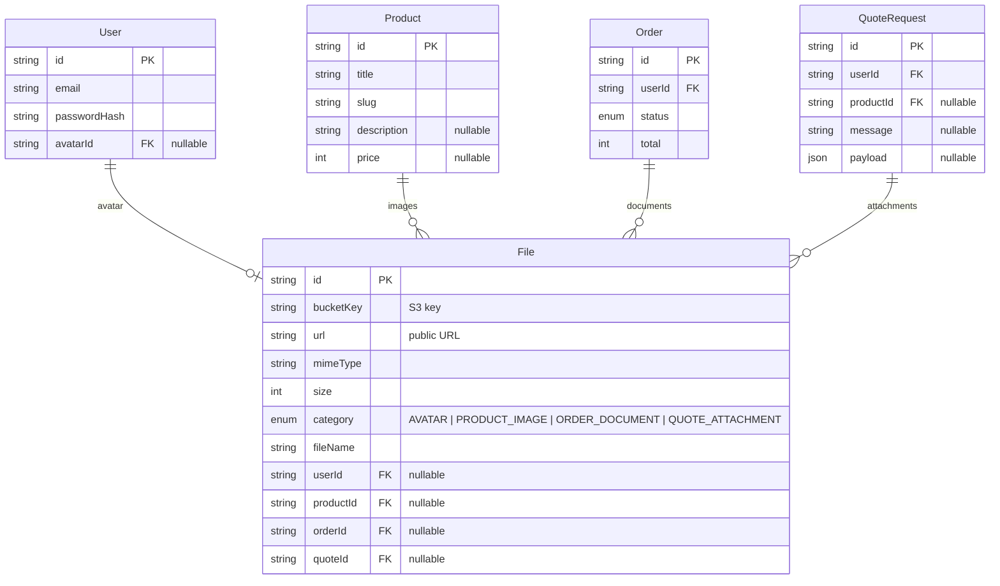

# S3-интеграция для BROX CRM

## 1. Анализ текущего API

### 1.1 Структура роутов

| Роут | Методы | Доступ | Описание |
|------|--------|--------|----------|
| `/api/health` | GET | public | Health check |
| `/api/auth/login` | POST | public | Аутентификация |
| `/api/auth/me` | GET | protected | Текущий пользователь |
| `/api/categories` | GET | public | Категории товаров |
| `/api/products` | GET | public | Товары |
| `/api/products/:slug` | GET | public | Деталь товара |
| `/api/admin/products` | POST/PUT/DELETE | admin | CRUD товаров |
| `/api/orders` | GET/POST | protected | Заказы |
| `/api/orders/:id` | GET | protected | Деталь заказа |
| `/api/orders/:id/status` | PUT | protected | Статус заказа |
| `/api/users` | CRUD | protected | Пользователи |
| `/api/events/track` | POST | public | Трекинг |
| `/api/metrics/track` | POST | public | Метрики |

### 1.2 Модели Prisma (текущие)

- **User** — id, email, passwordHash, createdAt (нет avatarUrl, нет avatarFileId)
- **Product** — title, slug, description, price, type, attributes (нет поля для файлов, только связь images)
- **ProductImage** — id, url, productId (url — строка, сейчас хранит прямые ссылки)
- **Order** — id, userId, status, total, items (нет вложений/документов)
- **QuoteRequest** — id, userId, productId, message, status, payload (нет вложений)
- **File** — id, url, type, createdAt (существует, но не используется)

### 1.3 Где нужна работа с файлами

| Сценарий | Модуль | Текущее состояние |
|----------|--------|-------------------|
| **Аватар пользователя** | Users | Не реализовано — нет поля avatar в User |
| **Изображения товаров** | Catalog / Admin | ProductImage.url — строка, сейчас хранит URL, но нет механизма загрузки |
| **Документы к заказу** (счета, ТЗ, чертежи) | Orders | Не реализовано — нет связи с файлами |
| **Вложения к заявке (QuoteRequest)** | Catalog | Не реализовано — нет поля для файлов |
| **Логотипы / брендинг** | Admin / Settings | Не реализовано |

---

## 2. Архитектура S3-интеграции

### 2.1 Выбор: presigned URLs vs загрузка через бэкенд

**Рекомендация: гибридный подход**

| Сценарий | Механизм | Причина |
|----------|----------|---------|
| Загрузка аватара (один файл, до 5 MB) | **Через бэкенд** | Проще контролировать, ресайз, валидация |
| Изображения товаров (batch, до 10 MB) | **Presigned URL** | Масштабирование, параллельная загрузка |
| Документы заказа (PDF, до 50 MB) | **Presigned URL** | Большие файлы, не нагружать бэкенд |

**Почему presigned URLs:**
- Бэкенд не тратит CPU/память на передачу файлов
- Клиент загружает напрямую в S3
- Можно установить лимит времени и размера
- S3 автоматически управляет multipart upload для больших файлов

### 2.2 Хранение ключей доступа

Файл [`../brox-api/.env`](.env) — добавить переменные:

```env
# S3 (MinIO / Yandex Object Storage / AWS S3)
S3_ENDPOINT=https://storage.yandexcloud.net
S3_REGION=ru-central1
S3_ACCESS_KEY_ID=your-access-key
S3_SECRET_ACCESS_KEY=your-secret-key
S3_BUCKET=brox-crm-files
S3_PUBLIC_URL=https://storage.yandexcloud.net/brox-crm-files
```

Файл [`../brox-api/src/config/env.js`](src/config/env.js) — добавить чтение:

```js
module.exports = {
  s3: {
    endpoint: process.env.S3_ENDPOINT,
    region: process.env.S3_REGION,
    accessKeyId: process.env.S3_ACCESS_KEY_ID,
    secretAccessKey: process.env.S3_SECRET_ACCESS_KEY,
    bucket: process.env.S3_BUCKET,
    publicUrl: process.env.S3_PUBLIC_URL,
  },
};
```

### 2.3 Структура ключей в S3 (bucket)

```
brox-crm-files/
├── avatars/
│   └── {userId}.{ext}          # аватар пользователя
├── products/
│   └── {productId}/
│       ├── {uuid}.{ext}        # изображение товара
│       └── {uuid}.{ext}
├── orders/
│   └── {orderId}/
│       ├── invoice-{uuid}.pdf  # счёт
│       └── spec-{uuid}.pdf     # спецификация
└── quotes/
    └── {quoteId}/
        └── {uuid}.{ext}        # вложение к заявке
```

---

## 3. Изменения в Prisma schema

### 3.1 Новая модель `File` (замена существующей заглушки)

```prisma
enum FileCategory {
  AVATAR
  PRODUCT_IMAGE
  ORDER_DOCUMENT
  QUOTE_ATTACHMENT
  BRANDING
}

model File {
  id        String   @id @default(cuid())
  bucketKey String   // ключ в S3 (например "avatars/user123.jpg")
  url       String   // публичный URL (presigned или постоянный)
  mimeType  String   // image/png, application/pdf
  size      Int      // размер в байтах
  category  FileCategory
  fileName  String   // оригинальное имя файла

  // Полиморфные связи (optional)
  userId    String?  // для аватара
  user      User?    @relation("UserAvatar", fields: [userId], references: [id], onDelete: SetNull)

  productId String?  // для изображений товаров
  product   Product? @relation(fields: [productId], references: [id], onDelete: Cascade)

  orderId   String?  // для документов заказа
  order     Order?   @relation(fields: [orderId], references: [id], onDelete: Cascade)

  quoteId   String?  // для вложений заявки
  quote     QuoteRequest? @relation(fields: [quoteId], references: [id], onDelete: Cascade)

  createdAt DateTime @default(now())
}
```

### 3.2 Изменения в существующих моделях

**User** — добавить связь с аватаром:

```prisma
model User {
  id           String @id @default(cuid())
  email        String @unique
  passwordHash String
  avatarId     String? // 👈 новое
  avatar       File?   @relation("UserAvatar", fields: [avatarId], references: [id]) // 👈 новое

  createdAt DateTime @default(now())

  sessions Session[]
  orders   Order[]
  quotes   QuoteRequest[]
  logs     ActivityLog[]
}
```

**Product** — заменить `ProductImage` на связь через `File`:

```prisma
model Product {
  // ... существующие поля
  images File[] // вместо ProductImage[]
}
```

**Order** — добавить связь с документами:

```prisma
model Order {
  // ... существующие поля
  documents File[] // документы заказа
}
```

**QuoteRequest** — добавить связь с вложениями:

```prisma
model QuoteRequest {
  // ... существующие поля
  attachments File[] // вложения
}
```

**Удалить модель `ProductImage`** — она заменяется на `File` с `category: PRODUCT_IMAGE`.

---

## 4. Новые эндпоинты

### 4.1 Upload-сервис (общий)

| Метод | Роут | Описание |
|-------|------|----------|
| POST | `/api/upload/avatar` | Загрузить аватар (multipart) |
| POST | `/api/upload/product-image/:productId` | Загрузить изображение товара |
| POST | `/api/upload/order-document/:orderId` | Загрузить документ к заказу |
| POST | `/api/upload/quote-attachment/:quoteId` | Загрузить вложение к заявке |
| GET | `/api/upload/presigned-url` | Получить presigned URL для прямой загрузки в S3 |
| DELETE | `/api/upload/:fileId` | Удалить файл |

### 4.2 Изменения в существующих эндпоинтах

| Роут | Изменение |
|------|-----------|
| `GET /api/users/:id` | Добавить `avatar` в select/include |
| `PUT /api/users/:id` | Добавить возможность обновлять `avatarId` |
| `GET /api/products/:slug` | Заменить `images` на `files` (File[]) |
| `POST /api/admin/products` | Добавить возможность привязывать файлы |
| `GET /api/orders/:id` | Добавить `documents` в include |
| `GET /api/quotes/:id` | Добавить `attachments` в include |

---

## 5. Пример кода: загрузка аватара пользователя

### 5.1 Установка зависимости

```bash
npm install @aws-sdk/client-s3 @aws-sdk/s3-request-presigner multer
```

### 5.2 S3-клиент (`src/services/s3.js`)

```js
const { S3Client } = require("@aws-sdk/client-s3");
const config = require("../config/env");

const s3 = new S3Client({
  endpoint: config.s3.endpoint,
  region: config.s3.region,
  credentials: {
    accessKeyId: config.s3.accessKeyId,
    secretAccessKey: config.s3.secretAccessKey,
  },
  forcePathStyle: config.s3.endpoint?.includes("localhost"), // для MinIO
});

module.exports = s3;
```

### 5.3 Upload service (`src/modules/upload/upload.service.js`)

```js
const { PutObjectCommand, DeleteObjectCommand, GetObjectCommand } = require("@aws-sdk/client-s3");
const { getSignedUrl } = require("@aws-sdk/s3-request-presigner");
const crypto = require("crypto");
const s3 = require("../../services/s3");
const config = require("../../config/env");
const prisma = require("../../db/prisma");

const ALLOWED_MIME_TYPES = {
  AVATAR: ["image/jpeg", "image/png", "image/webp"],
  PRODUCT_IMAGE: ["image/jpeg", "image/png", "image/webp", "image/avif"],
  ORDER_DOCUMENT: ["application/pdf", "image/jpeg", "image/png"],
  QUOTE_ATTACHMENT: ["application/pdf", "image/jpeg", "image/png", "application/x-zip-compressed"],
};

const MAX_FILE_SIZES = {
  AVATAR: 5 * 1024 * 1024,       // 5 MB
  PRODUCT_IMAGE: 10 * 1024 * 1024, // 10 MB
  ORDER_DOCUMENT: 50 * 1024 * 1024, // 50 MB
  QUOTE_ATTACHMENT: 50 * 1024 * 1024,
};

function generateKey(category, userId, ext) {
  const uuid = crypto.randomUUID();
  const prefix = {
    AVATAR: `avatars/${userId}`,
    PRODUCT_IMAGE: `products/${uuid}`,
    ORDER_DOCUMENT: `orders/${uuid}`,
    QUOTE_ATTACHMENT: `quotes/${uuid}`,
  };
  return `${prefix[category]}.${ext}`;
}

// Загрузка через бэкенд (для аватаров)
exports.uploadFile = async ({ buffer, mimeType, originalName, category, userId, productId, orderId, quoteId }) => {
  const allowed = ALLOWED_MIME_TYPES[category];
  if (!allowed?.includes(mimeType)) {
    throw new Error(`File type ${mimeType} not allowed for ${category}`);
  }

  const ext = mimeType.split("/")[1];
  const bucketKey = generateKey(category, userId, ext);

  await s3.send(new PutObjectCommand({
    Bucket: config.s3.bucket,
    Key: bucketKey,
    Body: buffer,
    ContentType: mimeType,
  }));

  const file = await prisma.file.create({
    data: {
      bucketKey,
      url: `${config.s3.publicUrl}/${bucketKey}`,
      mimeType,
      size: buffer.length,
      category,
      fileName: originalName,
      userId,
      productId,
      orderId,
      quoteId,
    },
  });

  return file;
};

// Presigned URL для прямой загрузки (для больших файлов)
exports.getPresignedUploadUrl = async ({ category, mimeType, userId, productId, orderId, quoteId }) => {
  const allowed = ALLOWED_MIME_TYPES[category];
  if (!allowed?.includes(mimeType)) {
    throw new Error(`File type ${mimeType} not allowed for ${category}`);
  }

  const ext = mimeType.split("/")[1];
  const bucketKey = generateKey(category, userId, ext);

  const command = new PutObjectCommand({
    Bucket: config.s3.bucket,
    Key: bucketKey,
    ContentType: mimeType,
  });

  const presignedUrl = await getSignedUrl(s3, command, { expiresIn: 3600 }); // 1 час

  return { presignedUrl, bucketKey, publicUrl: `${config.s3.publicUrl}/${bucketKey}` };
};

// Подтверждение загрузки по presigned URL
exports.confirmUpload = async ({ bucketKey, mimeType, size, originalName, category, userId, productId, orderId, quoteId }) => {
  return prisma.file.create({
    data: {
      bucketKey,
      url: `${config.s3.publicUrl}/${bucketKey}`,
      mimeType,
      size,
      category,
      fileName: originalName,
      userId,
      productId,
      orderId,
      quoteId,
    },
  });
};

// Удаление файла
exports.deleteFile = async (fileId) => {
  const file = await prisma.file.findUnique({ where: { id: fileId } });
  if (!file) throw new Error("File not found");

  await s3.send(new DeleteObjectCommand({
    Bucket: config.s3.bucket,
    Key: file.bucketKey,
  }));

  await prisma.file.delete({ where: { id: fileId } });

  return { ok: true };
};
```

### 5.4 Upload controller (`src/modules/upload/upload.controller.js`)

```js
const service = require("./upload.service");
const prisma = require("../../db/prisma");

// Загрузка аватара пользователя
exports.uploadAvatar = async (req, res) => {
  try {
    if (!req.file) {
      return res.status(400).json({ error: "No file provided" });
    }

    const { buffer, mimetype, originalname, size } = req.file;

    // Удаляем старый аватар, если есть
    const currentUser = await prisma.user.findUnique({
      where: { id: req.user.userId },
      select: { avatarId: true },
    });

    if (currentUser?.avatarId) {
      await service.deleteFile(currentUser.avatarId);
    }

    // Загружаем новый
    const file = await service.uploadFile({
      buffer,
      mimeType: mimetype,
      originalName: originalname,
      category: "AVATAR",
      userId: req.user.userId,
    });

    // Обновляем пользователя
    const user = await prisma.user.update({
      where: { id: req.user.userId },
      data: { avatarId: file.id },
      select: {
        id: true,
        email: true,
        avatar: true,
      },
    });

    res.json(user);
  } catch (e) {
    res.status(400).json({ error: e.message });
  }
};

// Получить presigned URL для загрузки
exports.getPresignedUrl = async (req, res) => {
  try {
    const { category, mimeType, productId, orderId, quoteId } = req.body;

    const result = await service.getPresignedUploadUrl({
      category,
      mimeType,
      userId: req.user.userId,
      productId,
      orderId,
      quoteId,
    });

    res.json(result);
  } catch (e) {
    res.status(400).json({ error: e.message });
  }
};

// Подтвердить загрузку по presigned URL
exports.confirmUpload = async (req, res) => {
  try {
    const { bucketKey, mimeType, size, originalName, category, productId, orderId, quoteId } = req.body;

    const file = await service.confirmUpload({
      bucketKey,
      mimeType,
      size,
      originalName,
      category,
      userId: req.user.userId,
      productId,
      orderId,
      quoteId,
    });

    // Если это аватар — обновляем пользователя
    if (category === "AVATAR") {
      await prisma.user.update({
        where: { id: req.user.userId },
        data: { avatarId: file.id },
      });
    }

    res.json(file);
  } catch (e) {
    res.status(400).json({ error: e.message });
  }
};

// Удалить файл
exports.remove = async (req, res) => {
  try {
    const result = await service.deleteFile(req.params.fileId);
    res.json(result);
  } catch (e) {
    res.status(400).json({ error: e.message });
  }
};
```

### 5.5 Upload routes (`src/modules/upload/upload.routes.js`)

```js
const router = require("express").Router();
const multer = require("multer");
const controller = require("./upload.controller");
const { authMiddleware } = require("../auth/auth.middleware");

const upload = multer({
  storage: multer.memoryStorage(),
  limits: { fileSize: 10 * 1024 * 1024 }, // 10 MB лимит для бэкенд-загрузки
});

router.use(authMiddleware);

// Загрузка через бэкенд (для маленьких файлов)
router.post("/avatar", upload.single("file"), controller.uploadAvatar);

// Presigned URL (для больших файлов)
router.post("/presigned-url", controller.getPresignedUrl);
router.post("/confirm", controller.confirmUpload);

// Удаление
router.delete("/:fileId", controller.remove);

module.exports = router;
```

### 5.6 Подключение в `app.js`

```js
// upload (protected)
const uploadRoutes = require("./modules/upload/upload.routes");
app.use("/api/upload", authMiddleware, uploadRoutes);
```

### 5.7 Фронтенд: загрузка аватара (React)

```tsx
// src/components/AvatarUpload.tsx
import React, { useCallback } from 'react';
import apiClient from '../api/client';

interface Props {
  currentAvatarUrl?: string | null;
  onAvatarChange: (url: string) => void;
}

export const AvatarUpload: React.FC<Props> = ({ currentAvatarUrl, onAvatarChange }) => {
  const handleFileChange = useCallback(async (e: React.ChangeEvent<HTMLInputElement>) => {
    const file = e.target.files?.[0];
    if (!file) return;

    const formData = new FormData();
    formData.append('file', file);

    const { data } = await apiClient.post('/upload/avatar', formData, {
      headers: { 'Content-Type': 'multipart/form-data' },
    });

    onAvatarChange(data.avatar?.url || '');
  }, [onAvatarChange]);

  return (
    <div className="avatar-upload">
      {currentAvatarUrl && (
        
      )}
      <label className="btn btn-sm btn-outline-primary mt-2">
        {currentAvatarUrl ? 'Изменить аватар' : 'Загрузить аватар'}
        <input type="file" accept="image/*" hidden onChange={handleFileChange} />
      </label>
    </div>
  );
};
```

---

## 6. Инструкция по внедрению

### Шаг 1: Установка зависимостей

```bash
cd ../brox-api
npm install @aws-sdk/client-s3 @aws-sdk/s3-request-presigner multer
```

### Шаг 2: Настройка .env

Добавить в [`../brox-api/.env`](.env):

```env
S3_ENDPOINT=https://storage.yandexcloud.net
S3_REGION=ru-central1
S3_ACCESS_KEY_ID=your-access-key
S3_SECRET_ACCESS_KEY=your-secret-key
S3_BUCKET=brox-crm-files
S3_PUBLIC_URL=https://storage.yandexcloud.net/brox-crm-files
```

### Шаг 3: Обновить Prisma schema

1. Заменить модель `File` на новую (с полиморфными связями)
2. Добавить `avatarId` в модель `User`
3. Добавить связи `File` в `Product`, `Order`, `QuoteRequest`
4. Удалить модель `ProductImage`
5. Выполнить миграцию:

```bash
npx prisma migrate dev --name add-s3-file-support
```

### Шаг 4: Создать файлы модуля upload

| Файл | Описание |
|------|----------|
| [`src/services/s3.js`](src/services/s3.js) | S3-клиент |
| [`src/modules/upload/upload.service.js`](src/modules/upload/upload.service.js) | Бизнес-логика |
| [`src/modules/upload/upload.controller.js`](src/modules/upload/upload.controller.js) | Контроллер |
| [`src/modules/upload/upload.routes.js`](src/modules/upload/upload.routes.js) | Роуты |

### Шаг 5: Подключить роуты в `app.js`

```js
const uploadRoutes = require("./modules/upload/upload.routes");
app.use("/api/upload", authMiddleware, uploadRoutes);
```

### Шаг 6: Обновить существующие сервисы

- [`users.service.js`](src/modules/users/users.service.js) — добавить `avatar` в select
- [`catalog.service.js`](src/modules/catalog/catalog.service.js) — заменить `images` на `files`
- [`orders.service.js`](src/modules/orders/orders.service.js) — добавить `documents` в include
- [`admin.service.js`](src/modules/admin/admin.service.js) — добавить привязку файлов к товарам

### Шаг 7: Фронтенд

- [`src/types/index.ts`](src/types/index.ts) — добавить тип `UploadedFile`
- [`src/api/client.ts`](src/api/client.ts) — добавить поддержку `multipart/form-data`
- Создать компонент [`AvatarUpload`](src/components/AvatarUpload.tsx)
- Обновить страницы профиля, товаров, заказов для отображения файлов

### Шаг 8: Настройка CORS для S3 (если используется MinIO)

Если S3-совместимое хранилище на другом домене, добавить CORS-политику:

```json
{
  "CORSRules": [
    {
      "AllowedOrigins": ["http://localhost:5173", "https://crm.brox.ru"],
      "AllowedMethods": ["GET", "PUT", "POST", "DELETE"],
      "AllowedHeaders": ["*"],
      "MaxAgeSeconds": 3600
    }
  ]
}
```

---

## 7. Схема данных (итоговая)



---

## 8. Резюме изменений

| Компонент | Файлы | Статус |
|-----------|-------|--------|
| Зависимости | `package.json` | +3 пакета |
| Конфигурация | `.env`, `src/config/env.js` | +6 переменных |
| Prisma schema | `prisma/schema.prisma` | Изменить модель File, User, Product, Order, QuoteRequest |
| S3-клиент | `src/services/s3.js` | Новый файл |
| Upload модуль | 4 файла в `src/modules/upload/` | Новый модуль |
| app.js | `src/app.js` | +3 строки (подключение роутов) |
| Существующие сервисы | users, catalog, orders, admin | Обновить select/include |
| Фронтенд: типы | `src/types/index.ts` | +тип UploadedFile |
| Фронтенд: компонент | `src/components/AvatarUpload.tsx` | Новый компонент |